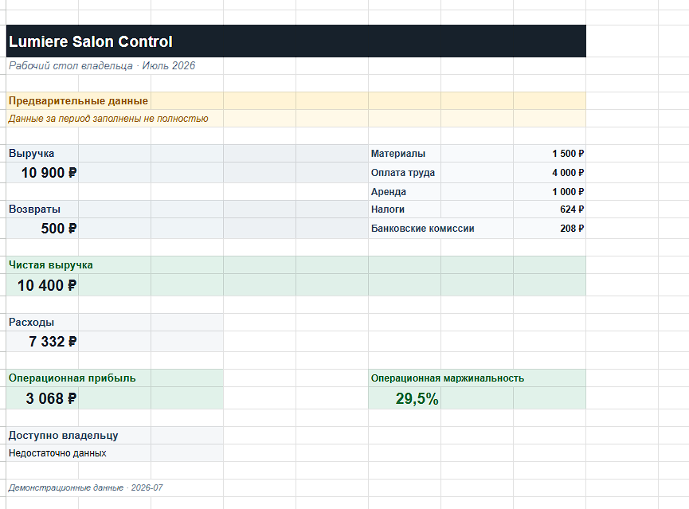
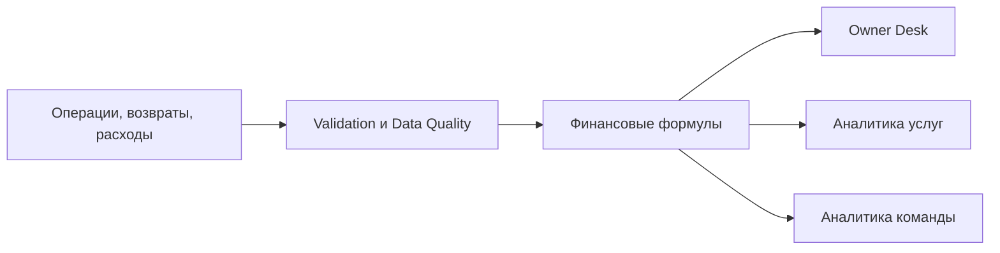

# Lumiere Salon Control

MVP системы управленческой финансовой аналитики для владельца небольшого салона красоты. Решение построено на Google Sheets и Google Apps Script и превращает первичные операции, возвраты и расходы в проверяемые финансовые показатели.

> Статус: демонстрационный MVP на обезличенных синтетических данных. Это не CRM, бухгалтерская система или готовый коммерческий SaaS.



## Задача

В небольшом сервисном бизнесе продажи, возвраты, выплаты сотрудникам, материалы, налоги и комиссии часто находятся в разных источниках. Из-за этого владельцу сложно понять фактический результат периода и отличить подтверждённые показатели от предварительных.

Lumiere Salon Control объединяет данные в последовательный процесс:

```text
Первичные данные -> проверки -> финансовые расчёты -> аналитические экраны
```

## Реализованный сценарий

Для контрольного периода `2026-07` система рассчитывает и согласовывает:

| Показатель | Значение |
|---|---:|
| Выручка | 10 900 ₽ |
| Возвраты | 500 ₽ |
| Чистая выручка | 10 400 ₽ |
| Расходы | 7 332 ₽ |
| Операционная прибыль | 3 068 ₽ |
| Операционная маржинальность | 29,5% |

Дополнительно работают экраны анализа услуг и команды. Показатели, для которых недостаточно исходных данных, отображаются как `Недостаточно данных`, а не как ноль.

## Ключевые возможности

- физическая модель из 31 листа;
- канонические таблицы операций, возвратов и расходов;
- справочники и управляемые выпадающие списки;
- явный статус полноты финансовых данных периода;
- идемпотентные Apps Script bootstrap- и write-функции;
- защита от повторной загрузки demo-записей;
- Owner Desk с выручкой, расходами, прибылью и статусом данных;
- аналитика услуг и команды;
- read-only end-to-end acceptance-проверка;
- 16 локальных regression suites.

## Архитектура



Финансовые определения отделены от представления. Apps Script отвечает за безопасную сборку книги, проверки и контролируемые записи; финансовые показатели рассчитываются прозрачными формулами Google Sheets.

## Надёжность

- запись выполняется только после полного preflight;
- повторный запуск не создаёт дубли;
- непустые конфликтующие данные не перезаписываются автоматически;
- отсутствие данных не интерпретируется как подтверждённый ноль;
- demo-период остаётся явно предварительным;
- контрольные суммы проверяются от источников до пользовательских экранов.

Финальная read-only приёмка: `demo_mvp_acceptance_passed`, все три пользовательских экрана валидны, блокеров нет.

## Технологии

Google Sheets, Google Apps Script, JavaScript, Node.js, clasp, Git, JSON contracts, финансовое моделирование, data validation, regression testing.

## Структура

- `src/apps-script/` - Apps Script runtime;
- `contracts/` - машиночитаемые финансовые и физические контракты;
- `data/demo/` - обезличенные демонстрационные данные;
- `tests/` - focused и regression tests;
- `docs/` - продуктовые и технические спецификации, ADR;
- `portfolio/` - материалы для презентации проекта.

## Локальная проверка

```powershell
node tests/apps-script/run-regression.mjs
```

Ожидаемый результат: `16/16` suites, errors `0`, warnings `0`.

## Ограничения

- универсальный импорт реальной CRM-выгрузки не завершён;
- реальные клиентские данные не использовались;
- прибыльность отдельных услуг и прямой результат мастеров не рассчитываются без прямого распределения затрат;
- загрузка команды не рассчитывается без данных о сменах;
- денежный блок и доступная владельцу сумма не включены в демонстрационный сценарий.

## Авторская роль

Business / System Analyst и разработчик решения: анализ бизнес-модели, финансовая логика, архитектура данных, Apps Script runtime, контроль качества, тестирование и дизайн управленческих экранов.
