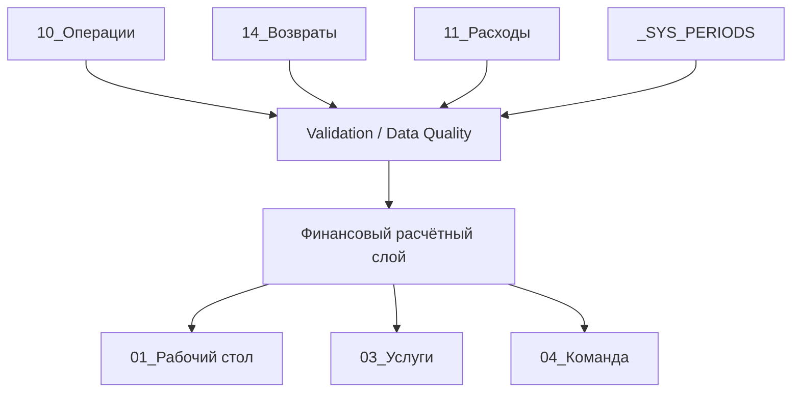

# Архитектура Lumiere Salon Control

## Поток данных



## Ответственность слоёв

| Слой | Ответственность |
|---|---|
| Ввод | Канонические операции, возвраты и расходы |
| Справочники | Статусы, категории, услуги, мастера и схемы оплаты |
| Контроль | Схема, обязательность, перечисления, уникальность, полнота |
| Расчёты | Финансовые формулы и согласование KPI |
| Представление | Owner Desk, услуги и команда |

## Почему формулы остаются в Google Sheets

Финансовые результаты видимы и проверяемы пользователем. Apps Script не создаёт альтернативную скрытую модель расчёта: он подготавливает структуру, проверяет данные и безопасно устанавливает утверждённые формулы.

## Безопасность записи

Каждая изменяющая книгу операция следует последовательности:

```text
read-only plan -> approval token -> повторный preflight -> batch write -> validation -> idempotency check
```

Конфликтующие непустые данные блокируют операцию. Повторный запуск не создаёт дубли и не перезаписывает подтверждённые строки.

## Работа с неполными данными

Период имеет явный статус полноты. Пока он `incomplete`, показатели маркируются как предварительные. Метрики без достаточных исходных данных показываются как `Недостаточно данных`.
